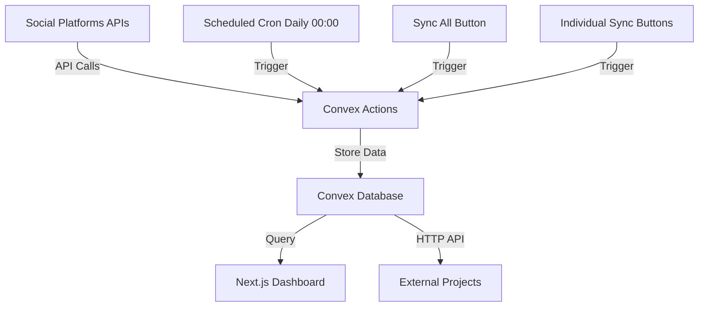

# Social Platform API Integration Plan

## Overview

Integrate 6 social platforms to fetch follower/subscriber metrics, store in Convex database, update via scheduled cron jobs and manual triggers, and expose via HTTP API for external projects like links.ryanfurrer.com.

## Architecture



## Data Requirements Per Platform

### Twitter/X

- **follower_count**: Number of followers
- **profile_url**: Profile URL (e.g., https://twitter.com/username)
- API field mapping: `public_metrics.followers_count` → `follower_count`

### Bluesky

- **follower_count**: Number of followers
- **profile_url**: Profile URL (e.g., https://bsky.app/profile/username.bsky.social)
- API field mapping: `followersCount` → `follower_count`

### LinkedIn

- **follower_count**: Number of followers
- **profile_url**: Profile URL
- API field mapping: Check LinkedIn API v2 response structure

### Twitch

- **follower_count**: Number of followers (free tier)
- **subscriber_count**: Number of subscribers (paid tier)
- **profile_url**: Channel URL (e.g., https://twitch.tv/username)
- API field mapping: `followers` → `follower_count`, `subscribers` → `subscriber_count`

### YouTube

- **follower_count**: Number of subscribers (free tier - mapped to follower_count for consistency)
- **profile_url**: Channel URL
- API field mapping: `statistics.subscriberCount` → `follower_count` (note: YouTube calls them "subscribers" but we store as followers to maintain free/paid distinction)

### GitHub

- **follower_count**: Number of followers
- **profile_url**: Profile URL (e.g., https://github.com/username)
- API field mapping: `followers` → `follower_count`

## Implementation Steps

### 1. Update Database Schema

**File:** `convex/schema.ts`

**IMPORTANT**: Make all new fields optional to avoid errors with existing data.

Update schema:

```typescript
socials: defineTable({
  follower_count: v.float64(), // existing - free tier metric (all platforms)
  platform: v.string(), // existing
  url: v.string(), // existing
  // New optional fields:
  subscriber_count: v.optional(v.float64()), // Paid tier metric (Twitch only)
  profile_url: v.optional(v.string()), // Explicit profile URL
  last_updated: v.optional(v.number()), // Unix timestamp
});
```

**Data Model Semantics:**

- `follower_count` = Free tier metric (Twitter, Bluesky, LinkedIn, GitHub, YouTube, Twitch)
- `subscriber_count` = Paid/premium tier metric (Twitch only)
- YouTube's "subscribers" are stored as `follower_count` to maintain semantic consistency

### 2. Create API Integration Actions

**File:** `convex/socials.ts` (expand existing file)

Create Convex actions (not queries) to fetch from external APIs. Each action should:

- Accept platform identifier or username/handle
- Fetch the required metrics from respective API
- Return structured data matching our schema
- Handle API errors gracefully

Actions to create:

- `fetchTwitterMetrics` - Twitter/X API v2
- `fetchBlueskyMetrics` - Bluesky ATProto API
- `fetchLinkedInMetrics` - LinkedIn API
- `fetchTwitchMetrics` - Twitch Helix API
- `fetchYouTubeMetrics` - YouTube Data API v3
- `fetchGitHubMetrics` - GitHub REST API

### 3. Create Database Mutations

**File:** `convex/socials.ts`

- `updateSocialMetrics` - Upsert social platform data (update or insert)
- `syncPlatform` - Sync a single platform (action that calls fetch + update)
- `syncAllPlatforms` - Orchestrate fetching from all platforms and updating DB

### 4. Set Up Scheduled Updates

**File:** `convex/cron.ts` (new file)

- Create cron job to run `syncAllPlatforms` daily at 00:00 (midnight)
- Use Convex `cronJobs` API
- Cron expression: `"0 0 * * *"` (daily at midnight UTC)

### 5. Create HTTP API Endpoints

**File:** `convex/http.ts` (new file)

- `GET /api/socials` - Public endpoint returning all social metrics as JSON
- `GET /api/socials/:platform` - Get specific platform metrics
- `POST /api/socials/sync` - Manual trigger endpoint (optional auth for security)

### 6. Update Socials Component

**File:** `components/socials.tsx`

- Display `last_updated` timestamp for each platform
- Add "Sync All" button that triggers `syncAllPlatforms` action
- Add individual sync button for each platform card
- Show loading states during sync operations
- Display both `follower_count` and `subscriber_count` when available

### 7. Environment Variables

**File:** `.env.local` (user will add)

Required API keys/credentials for free tiers:

#### Twitter/X

- `TWITTER_BEARER_TOKEN` - OAuth 2.0 Bearer token from Twitter Developer Portal

#### Bluesky

- `BLUESKY_HANDLE` - Your Bluesky handle (e.g., username.bsky.social)
- `BLUESKY_APP_PASSWORD` - App password from Bluesky settings

#### LinkedIn

- `LINKEDIN_ACCESS_TOKEN` - OAuth 2.0 access token
- `LINKEDIN_PERSON_ID` - Your LinkedIn person ID (URN format)

#### Twitch

- `TWITCH_CLIENT_ID` - Client ID from Twitch Developer Console
- `TWITCH_CLIENT_SECRET` - Client secret
- `TWITCH_USERNAME` - Your Twitch username

#### YouTube

- `YOUTUBE_API_KEY` - API key from Google Cloud Console
- `YOUTUBE_CHANNEL_ID` - Your YouTube channel ID

#### GitHub

- `GITHUB_USERNAME` - Your GitHub username (public API, no auth required)
- `GITHUB_TOKEN` - Optional, for higher rate limits (personal access token)

## Platform-Specific Implementation Notes

### Twitter/X

- **API**: Twitter API v2
- **Endpoint**: `GET /2/users/by/username/{username}?user.fields=public_metrics,username`
- **Auth**: OAuth 2.0 Bearer token
- **Cost**: API calls cost $0.010 per call (not free tier)
- **Rate Limits**: Varies by tier (Essential: 10,000 tweets/month)

### Bluesky

- **API**: ATProto (Bluesky's protocol)
- **Endpoint**: `GET https://public.api.bsky.app/xrpc/app.bsky.actor.getProfile?actor={handle}`
- **Auth**: No auth required for profile lookup (public API). Handle must be formatted as `username.bsky.social` or DID
- **Free Tier**: Public API
- **Rate Limits**: ~3000 requests/hour

### LinkedIn

- **API**: LinkedIn API v2
- **Endpoint**: `GET /v2/people/(id~)` or `/v2/networkSizes`
- **Auth**: OAuth 2.0 access token
- **Free Tier**: Limited requests
- **Rate Limits**: Varies by endpoint
- **Note**: Currently skipped due to API documentation complexity. Follower count not available for personal profiles via API. Returns 0 for follower_count, only provides profile_url.

### Twitch

- **API**: Twitch Helix API
- **Endpoint**: `GET /helix/channels/followers?broadcaster_id={broadcaster_id}` for followers, `/helix/channels?broadcaster_id={user_id}` for subscribers
- **Auth**: OAuth 2.0 Client Credentials flow (App Access Token) for follower count
- **Free Tier**: Public API
- **Rate Limits**: 800 requests/minute
- **Note**: Follower count works with App Access Token (Client Credentials). Subscriber count requires User Access Token with `channel:read:subscriptions` scope.

### YouTube

- **API**: YouTube Data API v3
- **Endpoint**: `GET /youtube/v3/channels?part=statistics&id={channel_id}`
- **Auth**: API key (no OAuth needed for public data)
- **Free Tier**: 10,000 units/day quota
- **Rate Limits**: Quota-based (1 unit per read request)

### GitHub

- **API**: GitHub REST API
- **Endpoint**: `GET /users/{username}`
- **Auth**: Optional (personal access token for rate limits)
- **Free Tier**: Public API, 60 requests/hour unauthenticated, 5,000/hour authenticated
- **Rate Limits**: 60/hour (no auth), 5,000/hour (with token)

## Files to Create/Modify

1. `convex/schema.ts` - Update schema with optional fields
2. `convex/socials.ts` - Add actions and mutations
3. `convex/cron.ts` - New file for scheduled jobs
4. `convex/http.ts` - New file for HTTP API
5. `components/socials.tsx` - Add sync buttons and last updated display

## Dependencies

No new npm packages required - Convex actions can use native `fetch` API.

## Platform Handles

All credentials are available in `.env.local`. Platform handles:

- **Twitter/X**: `ryandotfurrer`
- **Bluesky**: `ryandotfurrer`
- **LinkedIn**: `ryanfurrer` (Person ID: `urn:li:person:ryanfurrer`)
- **Twitch**: `ryandotfurrer`
- **YouTube**: `ryandotfurrer` (Channel ID: `UC55hUb2xxOcdig6fih490-g`)
- **GitHub**: `ryandotfurrer`

**Note**: GitHub contribution graph feature is deferred for now.

## Testing Strategy

1. Test each platform action individually with your credentials
2. Verify database updates with correct field mappings
3. Test HTTP endpoints return correct JSON structure
4. Verify cron job executes at 00:00 daily
5. Test manual sync buttons (all + individual)
6. Verify last_updated timestamps update correctly

## Implementation Progress

### Step 1: Update Database Schema ✅ COMPLETED

- ✅ Added optional `subscriber_count` field (v.optional(v.float64())) for Twitch paid tier
- ✅ Added optional `profile_url` field (v.optional(v.string())) for explicit profile URLs
- ✅ Added optional `last_updated` field (v.optional(v.number())) for Unix timestamp tracking
- All fields are optional to prevent errors with existing data
- Schema maintains backward compatibility with existing `follower_count`, `platform`, and `url` fields

**Findings:**

- Convex schema uses `v.optional()` wrapper for optional fields
- Existing required fields (`follower_count`, `platform`, `url`) remain unchanged
- Schema update is backward compatible - existing records will work without new fields

### Step 2: Create API Integration Actions ✅ COMPLETED

- ✅ `fetchTwitterMetrics` - Twitter/X API v2
- ✅ `fetchBlueskyMetrics` - Bluesky ATProto API
- 🛑 `fetchLinkedInMetrics` - LinkedIn API v2 — on hold for nowd
- ✅ `fetchTwitchMetrics` - Twitch Helix API
- ✅ `fetchYouTubeMetrics` - YouTube Data API v3
- ✅ `fetchGitHubMetrics` - GitHub REST API

**Findings:**

- **Twitter**: `/2/users/me` requires user context auth; use `/2/users/by/username/{username}` with bearer token for public data. API calls cost $0.010 per call.
- **Bluesky**: Public profile endpoint requires no auth. Handle must be formatted as `username.bsky.social` or DID. Response field is `followersCount`.
- **LinkedIn**: Follower count not easily available via API for personal profiles. Returns 0 as placeholder. Uses `/v2/people` endpoint with vanityName for profile URL. Currently marked as pending due to API documentation complexity.
- **Twitch**: Requires OAuth token via client credentials flow. Follower count uses `/helix/channels/followers` endpoint which provides total count directly. Subscriber count requires User Access Token with `channel:read:subscriptions` scope (not implemented with current App Access Token).
- **YouTube**: Uses `/youtube/v3/channels` endpoint with statistics part. Maps `subscriberCount` to `follower_count` for consistency.
- **GitHub**: Uses `/users/{username}` endpoint. Optional token for higher rate limits. Returns `followers` field as `follower_count`.

### Step 3: Create Database Mutations ✅ COMPLETED

- ✅ `updateSocialMetrics` mutation - Upserts social platform data with optional fields
- ✅ `syncPlatform` action - Syncs a single platform (fetch + update)
- ✅ `syncAllPlatforms` action - Orchestrates all platform syncs with error handling

**Findings:**

- Mutation uses upsert pattern (find by platform, update or insert)
- Actions use `api` from `./_generated/api` to reference other actions/mutations
- `syncAllPlatforms` uses `Promise.allSettled` to handle partial failures gracefully
- Platform names are normalized to lowercase for consistency

### Step 4: Set Up Scheduled Updates ✅ COMPLETED

- ✅ Create `convex/cron.ts` file
- ✅ Configure daily cron job at 00:00 UTC using `cronJobs().daily()`

**Findings:**

- Convex uses `cronJobs()` API with `daily()` method for scheduled jobs
- Cron job configured to run `syncAllPlatforms` at midnight UTC daily

### Step 5: Create HTTP API Endpoints ⏳ PENDING (Stopped after Step 4)

- ⏳ Create `convex/http.ts` file
- ⏳ GET `/api/socials` endpoint
- ⏳ GET `/api/socials/:platform` endpoint
- ⏳ POST `/api/socials/sync` endpoint
- ⏳ Add CORS headers

### Step 6: Update Socials Component ⏳ PENDING (Stopped after Step 4)

- ⏳ Display `last_updated` timestamp
- ⏳ Add "Sync All" button
- ⏳ Add individual sync buttons
- ⏳ Add loading states
- ⏳ Display `subscriber_count` when available

## Notes for Future Reference

- All new schema fields are optional to prevent errors with existing data
- **Data Model**: `follower_count` = free tier (all platforms), `subscriber_count` = paid tier (Twitch only)
- YouTube's API returns "subscribers" but we map to `follower_count` for semantic consistency
- Free API tiers have rate limits - consider implementing retry logic
- Some platforms may require periodic token refresh (LinkedIn, Twitch)
- HTTP API should be CORS-enabled for external project access
- LinkedIn Person ID in `.env.local` is `urn:li:person:ryanfurrer` - verify this is correct format during implementation (should be `urn:li:person:{actual_id}` where ID is from `/v2/me` response)
